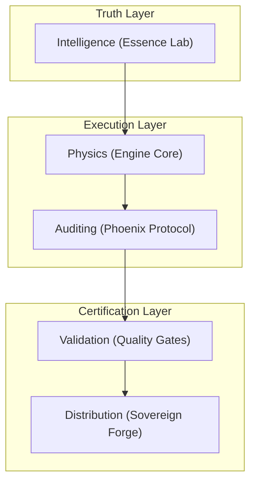

# Architecture Map: TRADER_OPS Sovereign Protocol

This document provides a high-level mapping of the TRADER_OPS system to facilitate rapid agentic onboarding and prevent architectural regressions.

---

## 1. System Layers (Holistic Topology)

### 1.1 Truth Layer (`antigravity_harness/essence.py`)
- **Responsibility**: Ingesting, signing, and average-weighting market intelligence.
- **Key Modules**: `EssenceLab`, `parse_cnn_fear_greed`, `parse_market_alpha`.
- **Constraint**: Must remain decoupled from executor state.

### 1.2 Execution Layer (`antigravity_harness/engine.py`)
- **Responsibility**: Deterministic event-driven backtesting with conservative slippage modeling.
- **Key Modules**: `Engine`, `PortfolioEngine`, `PortfolioRouter`.
- **Physics Rule**: Signals are shifted $t+1$ to ensure zero look-ahead bias.

### 1.3 Auditing Layer (`antigravity_harness/phoenix.py`)
- **Responsibility**: Real-time invariant enforcement and forensic trail generation.
- **Key Modules**: `SovereignAuditor`.
- **Historical Note**: Replaces the legacy `WriteAheadLog` with a unified session-aware SQLite store.

### 1.4 Distribution Layer (`antigravity_harness/forge/build.py`)
- **Responsibility**: Creating bit-perfect, cryptographically signed release artifacts.
- **Key Files**: `make_drop_packet.py`, `verify_drop_packet.py`.
- **Security Guard**: `STRICT_MODE` ensures no bytecode or unversioned/dirty files enter the drop.

---

## 2. Component Interaction (The Lifecycle)

1.  **Ingest**: `scripts/ingest_essence.py` fetches data -> Signs it -> Saves to `data/`.
2.  **Simulation**: `cli.py certify-run` initializes the `Engine`.
3.  **Auditing**: The `Engine` pushes every event (Trade, Signal, Exception) to the `SovereignAuditor`.
4.  **Reporting**: On shutdown, the `Auditor` writes `reports/auditing/FINAL_AUDIT_REPORT.md` and generates a verifiable Merkle root.
5.  **Assembly**: The `Forge` gathers these artifacts, verifies them using `verify_drop_packet.py`, and seals them with a Fiduciary Certificate.

---

## 3. Defense Vectors (Hydra Guards)

The system is hardened against 225+ localized attack vectors, including:
- **Vector 80**: Unicode Homoglyph filename detection.
- **Vector 101/111**: Path Traversal and Null Byte injection prevention.
- **Vector 120**: "Time Reverse" protection (asserting chronological monotonicity in all logs).

---

## 4. Anti-Regression Strategy
- **Baseline Testing**: `tests/test_baselines.py` ensures strategy returns never fluctuate between engine versions.
- **Audit Verification**: `tests/test_engine_wal.py` ensures the modern auditor maintains legacy contract compliance.
- **Build Purity**: `STRICT_MODE=1` in the forge prevents accidental leakage into the distributed core.
