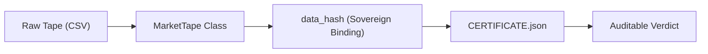

# TRADER_OPS Data Provenance

Every trading strategy is only as good as its data. This document tracks the 
fiduciary chain of custody for all market data used in system validation.

---

## Provenance Chain

## Tape Inventory

| Asset | Timeframe | Type | Source | Path |
|-------|-----------|------|--------|------|
| `MES` | 5m | Real (IBKR RTH) | Interactive Brokers | `data/ibkr/mes_5m_ibkr_rth.csv` |
| `MES` | 5m | Synthetic (Test Fixtures) | Deterministic Generator | `tests/fixtures/synthetic/mes_5m_synthetic.csv` |

## Integrity Rules

1. **Deterministic Hashing**: The `data_hash` in the fiduciary certificate is computed by the `MarketTape` class. It rounds price data to 8 decimal places and sorts by timestamp to ensure identical hashes across different Python installations and CPU architectures.
2. **Immutability**: Once a drop packet is forged, the `data_hash` is sealed into the signed `CERTIFICATE.json`. Any modification to the source CSV will invalidate the audit.
3. **Data Provenance Tags**: Every dataset must declare provenance: `real`, `synthetic`, `control_synthetic`, `control_noise`, or `unknown`. Unknown provenance triggers FAIL CLOSED. See `docs/constitution/LAWS.md` Article III, LAW 3.7.

## How to Verify
To verify the integrity of the data used in a specific run:
1. Extract `TRADER_OPS_READY_TO_DROP_v*.zip`.
2. Locate `data/*.csv`.
3. Run `python3 -m mantis_core.data.market_tape <csv_path>` to compute the local hash.
4. Compare with `bindings.data_hash` inside `reports/certification/CERTIFICATE.json`.
