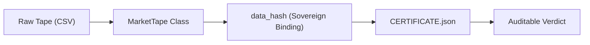

# TRADER_OPS Data Provenance (v4.5.29)

Every trading strategy is only as good as its data. This document tracks the 
fiduciary chain of custody for all market data used in system validation.

---

## Provenance Chain

## Tape Inventory

| Asset | Timeframe | Type | Start | End | Source Hash |
|-------|-----------|------|-------|-----|-------------|
| `MES` | 5m | Synthetic | 2026-02-09 | 2026-02-13 | `data/mes_5m_synthetic.csv` |

## Integrity Rules

1. **Deterministic Hashing**: The `data_hash` in the fiduciary certificate is computed by the `MarketTape` class. It rounds price data to 8 decimal places and sorts by timestamp to ensure identical hashes across different Python installations and CPU architectures.
2. **Immutability**: Once a drop packet is forged, the `data_hash` is sealed into the signed `CERTIFICATE.json`. Any modification to the source CSV will invalidate the audit.
3. **Synthetic Scaffold**: Current production runs use a high-fidelity synthetic scaffold. True institutional tape ingestion is planned for v4.6.x.

## How to Verify
To verify the integrity of the data used in a specific run:
1. Extract `TRADER_OPS_READY_TO_DROP_v*.zip`.
2. Locate `data/*.csv`.
3. Run `python3 -m antigravity_harness.data.market_tape <csv_path>` to compute the local hash.
4. Compare with `bindings.data_hash` inside `reports/certification/CERTIFICATE.json`.
